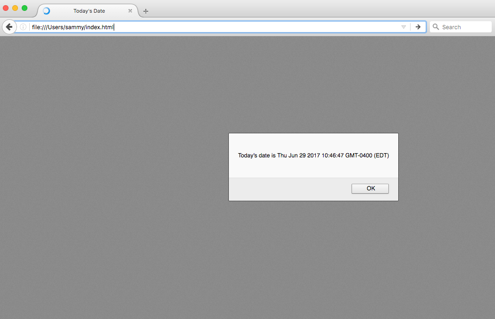
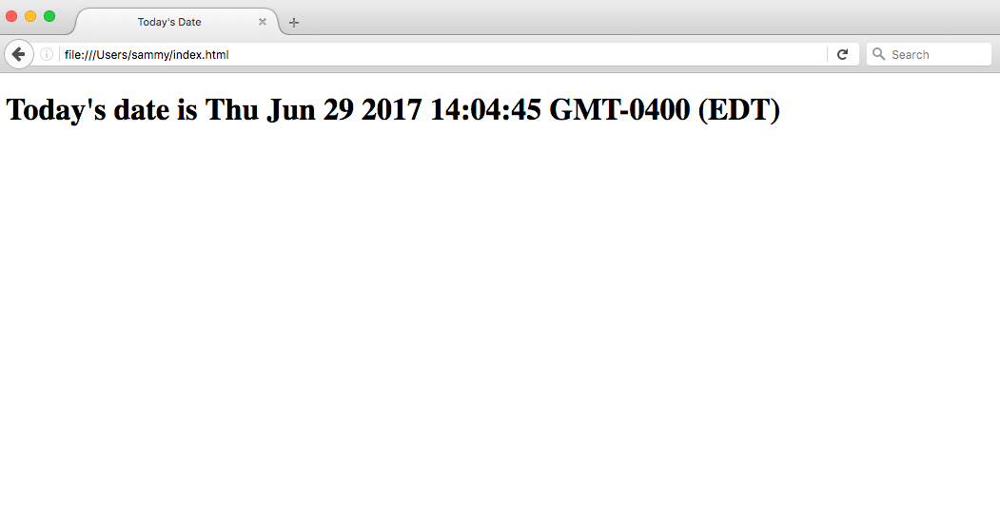
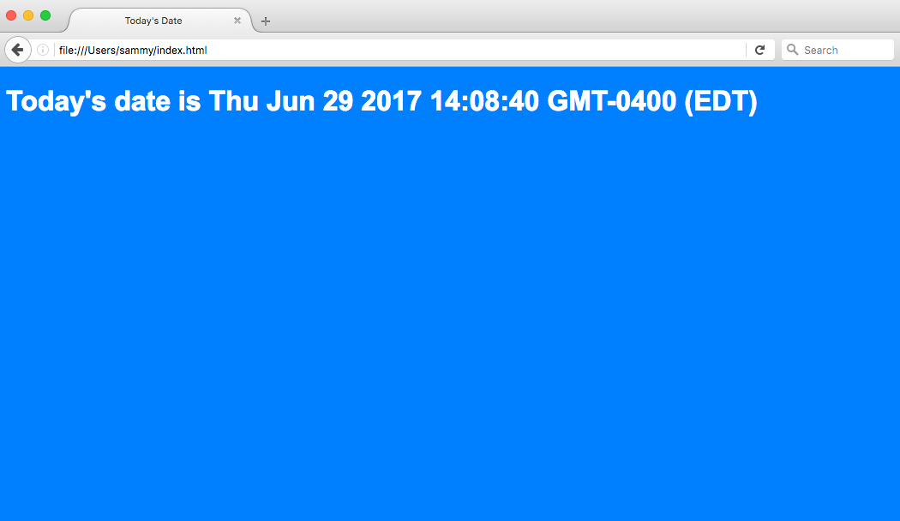

# Cómo Agregar JavaScript a HTML

:::info
La fuente original (en ingles) de este tutorial se encuentra [aquí](https://www.digitalocean.com/community/tutorials/how-to-add-javascript-to-html)
:::

## Introducción

JavaScript, también abreviado como JS, es un lenguaje de programación utilizado en el desarrollo web. Como una de las tecnologías centrales de la web junto con HTML y CSS, JavaScript se utiliza para hacer que las páginas web sean interactivas y crear aplicaciones web. Los navegadores web modernos, que cumplen con estándares de visualización comunes, admiten JavaScript a través de motores integrados sin necesidad de complementos adicionales.

Cuando se trabaja con archivos para la web, es necesario cargar JavaScript y ejecutarlo junto con el marcado HTML. Esto se puede hacer en línea dentro de un documento HTML o en un archivo separado que el navegador descargará junto con el documento HTML.

Este tutorial explicará cómo incorporar JavaScript en sus archivos web, tanto en línea en un documento HTML como en un archivo separado.

## Agregar JavaScript a un Documento HTML

Puede agregar código JavaScript en un documento HTML empleando la dedicada etiqueta HTML `<script>` que envuelve el código JavaScript.

La etiqueta `<script>` se puede colocar en la sección `<head>` de su HTML o en la sección `<body>`, dependiendo de cuándo desee que se cargue JavaScript.

Generalmente, el código JavaScript puede ir dentro de la sección `<head>` del documento para mantenerlo contenido y fuera del contenido principal de su documento HTML.

Sin embargo, si su script necesita ejecutarse en un punto determinado dentro del diseño de una página (como cuando usa `document.write` para generar contenido), debe colocarlo en el punto donde debe llamarse, generalmente dentro de la sección `<body>`.

Consideremos el siguiente documento HTML en blanco con el título del navegador `Today's Date`:

📃`./index.html`
```html
<!DOCTYPE html>
<html lang="en-US">
 
<head>
    <meta charset="UTF-8">
    <meta name="viewport" content="width=device-width, initial-scale=1">
    <title>Today's Date</title>
</head>
 
<body>
 
</body>
 
</html>
```

En este momento, este archivo solo contiene marcado HTML. Digamos que nos gustaría agregar el siguiente código JavaScript al documento:


```js
let d = new Date();
alert("Today's date is " + d);
```

Esto permitirá que la página web muestre una alerta con la fecha actual independientemente de cuándo el usuario cargue el sitio.

Para lograr esto, agregaremos una etiqueta `<script>` junto con algún código JavaScript al archivo HTML.

Para empezar, agregaremos el código JavaScript entre las etiquetas `<head>`, indicando al navegador que ejecute el script JavaScript antes de cargar el resto de la página. Podemos agregar JavaScript debajo de las etiquetas `<title>`, por ejemplo, como se muestra a continuación:


📃`./index.html`
```html{8,9,10,11}
<!DOCTYPE html>
<html lang="en-US">
 
<head>
    <meta charset="UTF-8">
    <meta name="viewport" content="width=device-width, initial-scale=1">
    <title>Today's Date</title>
    <script>
        let d = new Date();
        alert("Today's date is " + d);
    </script>
</head>
 
<body>
 
</body>
 
 
 
</html>
```

Una vez que cargues la página, recibirás una alerta similar a esta:



Si estuviéramos modificando lo que se muestra en el cuerpo del HTML, necesitaríamos implementarlo después de la sección `<head>` para que se muestre en la página, como en el siguiente ejemplo:

📃`./index.html`
```html{14}
<!DOCTYPE html>
<html lang="en-US">
 
<head>
    <meta charset="UTF-8">
    <meta name="viewport" content="width=device-width, initial-scale=1">
    <title>Today's Date</title>
</head>
 
<body>
  
  <script>
      let d = new Date();
      document.body.innerHTML = "<h1>Today's date is " + d + "</h1>"
  </script>
 
</body>
 
</html>
```

El resultado del documento HTML anterior cargado a través de un navegador web sería similar al siguiente:



Los scripts que son pequeños o que se ejecutan solo en una página pueden funcionar bien dentro de un archivo HTML, pero para scripts más grandes o scripts que se usarán en muchas páginas, no es una solución muy efectiva porque incluirlos puede resultar difícil de manejar o de leer. y entender. En la siguiente sección, veremos cómo manejar un archivo JavaScript separado en su documento HTML.

## Trabajar con un Archivo JavaScript Separado

Para dar cabida a scripts más grandes o scripts que se utilizarán en varias páginas, el código JavaScript generalmente reside en uno o más archivos `js` a los que se hace referencia en documentos HTML, de manera similar a como se hace referencia a activos externos como CSS.

Los beneficios de utilizar un archivo JavaScript independiente incluyen:

- Separar el marcado HTML y el código JavaScript para que ambos sean más sencillos
- Los archivos separados facilitan el mantenimiento
- Cuando los archivos JavaScript se almacenan en caché, las páginas se cargan más rápidamente

Para demostrar cómo conectar un documento JavaScript a un documento HTML, creemos un pequeño proyecto web. Constará de `script.js` en el directorio `js/`, `style.css` en el directorio `css/` y un `index.html` principal en la raíz del proyecto.


```
project/
├── css/
|   └── style.css
├── js/
|   └── script.js
└── index.html
```

Podemos comenzar con nuestra plantilla HTML previa de la sección anterior:

📃`./index.html`
```html
<!DOCTYPE html>
<html lang="en-US">
 
<head>
    <meta charset="UTF-8">
    <meta name="viewport" content="width=device-width, initial-scale=1">
    <title>Today's Date</title>
</head>
 
<body>
 
</body>
 
</html>
```

Ahora, movamos nuestro código JavaScript que mostrará la fecha como un encabezado `<h1>` al archivo `script.js`:

📃`./js/script.js`
```js
let d = new Date();
document.body.innerHTML = "<h1>Today's date is " + d + "</h1>"
```

Podemos agregar una referencia a este script en la sección `<body>`, con la siguiente línea de código:

```html
<script src="js/script.js"></script>
```

La etiqueta `<script>` apunta al archivo `script.js` en el directorio `js/` de nuestro proyecto web.

Consideremos esta línea en el contexto de nuestro archivo HTML, en este caso, dentro de la sección `<body>`:

📃`./index.html`
```html{12}
<html lang="en-US">
 
<head>
    <meta charset="UTF-8">
    <meta name="viewport" content="width=device-width, initial-scale=1">
    <title>Today's Date</title>
</head>
 
<body>
 

<script src="js/script.js"></script>

</body> 
 
</html>
```

Finalmente, editemos también el archivo `style.css` agregando un color de fondo y un estilo al encabezado `<h1>`:

📃`./css/style.css`
```css
body {
    background-color: #0080ff;
}
 
h1 {
    color: #fff;
    font-family: Arial, Helvetica, sans-serif;
}
```

Podemos hacer referencia a ese archivo CSS dentro de la sección `<head>` de nuestro documento HTML:

📃`./index.html`
```html{8}
<!DOCTYPE html>
<html lang="en-US">
 
<head>
    <meta charset="UTF-8">
    <meta name="viewport" content="width=device-width, initial-scale=1">
    <title>Today's Date</title>
    <link rel="stylesheet" href="css/style.css">
</head>
 
<body>
 

<script src="js/script.js"></script>

</body>
 
</html>
```

Ahora, con JavaScript y CSS implementados, podemos cargar la página `index.html` en el navegador web de nuestra elección. Deberíamos ver una página similar a la siguiente:



Ahora que hemos colocado JavaScript en un archivo, podemos llamarlo de la misma manera desde páginas web adicionales y actualizarlas todas en una sola ubicación.

## Conclusión

Este tutorial explicó cómo incorporar JavaScript en sus archivos web, tanto en línea en un documento HTML como como un archivo `.js` separado.
