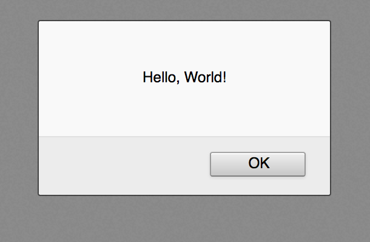
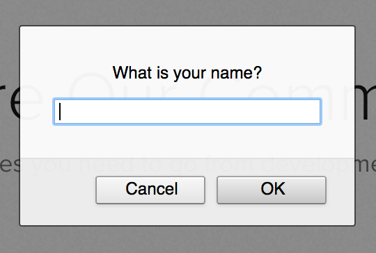
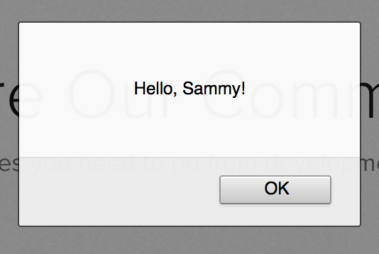

# Cómo Escribir Su Primer Programa JavaScript

:::info
La fuente original (en ingles) de este tutorial se encuentra [aquí](https://www.digitalocean.com/community/tutorials/how-to-write-your-first-javascript-program)
:::

## Introducción

El programa _"Hello, World!"_ es una tradición clásica y consagrada en la programación de computadoras. Es un primer programa breve y completo para principiantes y es una buena manera de asegurarse de que su entorno esté configurado correctamente.

Este tutorial lo guiará en la creación de este programa en JavaScript. Sin embargo, para hacer el programa más interesante, modificaremos el tradicional programa _"Hello, World!"_  para que pida al usuario su nombre. Luego usaremos el nombre en un saludo. Cuando haya terminado con este tutorial, tendrá un programa interactivo _"Hello, World!"_.

## Requisitos previos


You can complete this tutorial by using the JavaScript Developer Console in your web browser. Before beginning this tutorial, you should have some familiarity with working with this tool. To learn more about it, you can read our tutorial “How To Use the JavaScript Developer Console.”


Puede completar este tutorial utilizando la Consola de Desarrollador de JavaScript en su navegador web. Antes de comenzar este tutorial, debe estar familiarizado con el trabajo con esta herramienta. Para obtener más información al respecto, puede leer el tutorial "[Cómo Utilizar la Consola para Desarrolladores de Javascript](./how-to-use-the-js-dev-console.html)".


## Creando el Programa _"Hello, World!"_

Para escribir el programa _"Hello, World!"_, primero abra la consola JavaScript de su navegador web preferido.

Hay dos formas principales en las que podemos crear el programa _"Hello, World!"_ en JavaScript, con el método `alert()` y con el método `console.log()`.

## Usando `alert()`

La primera forma en que podemos escribir este programa es usando el método `alert()`, que mostrará un cuadro de alerta sobre su ventana actual con un mensaje específico (en este caso, será _"Hello, World!"_) y un `OK`. Botón que permitirá al usuario cerrar la alerta.

Dentro del método pasaremos el tipo de datos [string](./how-to-work-with-strings-in-javascript.html) como parámetro. Esta cadena se establecerá en el valor `Hello, World!` para que ese valor se imprima en el cuadro de alerta.

To write this first style of “Hello, World!” program, we’ll encase the string within the parentheses of the alert() method. We’ll end our JavaScript statement with a semicolon.

Para escribir este primer estilo del programa _"Hello, World!"_, encerraremos la cadena entre los paréntesis del método `alert()`. Terminaremos nuestra declaración de JavaScript con un [punto y coma](./understanding-syntax-and-code-structure-in-javascript.html#punto-y-coma).


```js
alert("Hello, World!");
```

Una vez que presione la tecla `ENTER` siguiendo su línea de JavaScript, debería ver la siguiente alerta emergente en su navegador:



La Consola también imprimirá el resultado de la evaluación de una expresión, que se leerá como `undefined` cuando la expresión no devuelva algo explícitamente.

Puede resultar tedioso seguir haciendo clic en las alertas emergentes, así que veamos cómo crear el mismo programa registrándolo en la consola con `console.log()`.

## Usando console.log()

Podemos imprimir la misma cadena, excepto que esta vez en la consola JavaScript, usando el método `console.log()`. Usar esta opción es similar a trabajar con un lenguaje de programación en el entorno de terminal de su computadora.

Como hicimos con `alert()`, pasaremos la cadena _"Hello, World!"_ al método `console.log()`, entre paréntesis. Terminaremos nuestra declaración con un punto y coma, como es típico en las convenciones de sintaxis de JavaScript.


```js
console.log("Hello, World!");
```

Una vez que presionamos `ENTER`, el mensaje `Hello, World!` se imprimirá en la consola:


```sh
Output
Hello, World!
```

En la siguiente sección, veremos cómo hacer que este programa sea más interactivo para el usuario.

## Solicitar entrada

Cada vez que ejecutamos nuestro programa _"Hello, World!"_, produce el mismo resultado. Preguntemos a la persona que ejecuta nuestro programa su nombre. Luego podemos usar ese nombre para personalizar la salida.

Para cada uno de nuestros métodos de JavaScript que utilizamos anteriormente, podemos comenzar con una línea solicitando entrada. Usaremos el método `prompt()` de JavaScript y le pasaremos la cadena `"What is your name?"` para preguntarle al usuario su nombre. La entrada ingresada por el usuario se almacenará en el nombre de la variable. Terminaremos nuestra expresión con un punto y coma.

Para cada uno de nuestros métodos de JavaScript que utilizamos anteriormente, podemos comenzar con una línea solicitando entrada. Usaremos el método Prompt() de JavaScript y le pasaremos la cadena "¿Cuál es tu nombre?" para preguntarle al usuario su nombre. La entrada ingresada por el usuario se almacenará en la [variable](./understanding-variables-scope-and-hoisting.html) `name`. Terminaremos nuestra expresión con un punto y coma.


```js
let name = prompt("What is your name?");
```

Cuando presiona `ENTER` para ejecutar esta línea de código, recibirá un mensaje emergente:




El cuadro de diálogo que aparece en la ventana de su navegador web incluye un campo de texto para que el usuario ingrese información. Una vez que el usuario ingresa un valor en el campo de texto, deberá hacer clic en `OK` para que se almacene el valor. El usuario también puede evitar que se registre un valor haciendo clic en el botón `Cancel`.

Es importante utilizar el método `prompt()` de JavaScript solo cuando tenga sentido dentro del contexto del programa, ya que su uso excesivo puede resultar tedioso para el usuario.

En este punto, ingrese el nombre que desea que salude el programa. Para este ejemplo, usaremos el nombre `Sammy`.

Ahora que hemos recopilado el valor del nombre del usuario, podemos pasar a utilizar ese valor para saludar al usuario.

## Saludo a la Usuario con `alert()`

Como se mencionó anteriormente, el método `alert()` crea un cuadro emergente sobre la ventana del navegador. Podemos utilizar este método para saludar al usuario haciendo uso de la variable `name`.

Utilizaremos la [concatenación de cadenas](how-to-work-with-strings-in-javascript.html#concatenacion-de-cadenas) para escribir un saludo de _"Hello!"_ que se dirige directamente al usuario. Entonces, concatenemos la cadena de `Hello` con la variable `name`:


```js
"Hello, " + name + "!"
```

Hemos combinado dos cadenas, `"Hello, "` con la variable `name`  en el medio. Ahora podemos pasar esta expresión al método `alert()`.


```js
alert("Hello, " + name + "!");
```

Una vez que presionemos `ENTER` aquí, recibiremos el siguiente cuadro de diálogo en la pantalla:



En este caso, el nombre del usuario es Sammy, por lo que el resultado saluda a Sammy.

Ahora reescribamos esto para que la salida se imprima en la consola.

## Saludar al Usuario con _console.log()_

Como vimos en una sección anterior, el método `console.log()` imprime la salida en la consola, al igual que la función `print()` puede imprimir la salida en la terminal en Python.

Usaremos la misma cadena concatenada que usamos con el método `alert()`, que combina las cadenas `"Hello, "` y `"!" ` con variable `name`:


```js
"Hello, " + name + "!"
```

Esta expresión completa se colocará entre paréntesis del método `console.log()` para que recibamos un saludo como resultado.


```js
console.log("Hello, " + name + "!");
```

Para un usuario llamado Sammy, el resultado en la consola será el siguiente:


```sh
Output
Hello, Sammy!
```

Ahora tiene un programa JavaScript que toma la información de un usuario y la imprime en la pantalla.


## Conclusión

Ahora que sabes cómo escribir el clásico programa _“Hello, World!”_, además de solicitar información al usuario y mostrarla como salida, puede trabajar para expandir aún más su programa. Por ejemplo, pregunte el color favorito del usuario y haga que el programa le diga que su color favorito es el rojo. Incluso podrías intentar utilizar esta misma técnica para crear un programa Mad Lib.


