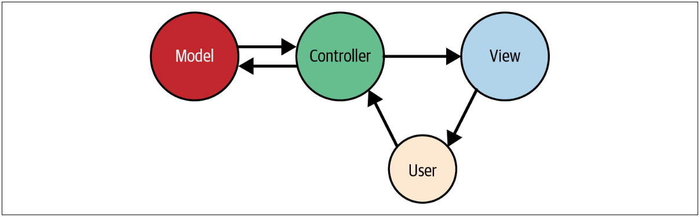

# Enrutamiento y Controladores

>La función esencial de cualquier framework de aplicación web es recibir solicitudes de un usuario y entregar respuestas, generalmente a través de HTTP(S). Esto significa que definir las rutas de una aplicación es el primer y más importante proyecto que se debe abordar al aprender a usar un framework web; sin rutas, no se tiene la capacidad de interactuar con el usuario final.

>En este capítulo, examinaremos las rutas en Laravel; verá cómo definirlas, cómo indicarles el código que deben ejecutar y cómo usar las herramientas de enrutamiento de Laravel para manejar una amplia variedad de necesidades de enrutamiento.

## Una Breve Introducción a MVC, los Verbos HTTP y REST

La mayor parte de lo que hablaremos en este capítulo hace referencia a cómo se estructuran las aplicaciones Modelo-Vista-Controlador (MVC), y muchos de los ejemplos que veremos usan nombres de ruta y verbos similares a REST, así que echemos un vistazo rápido a ambos.

## ¿Qué es MVC?

En MVC, tienes tres conceptos principales:

- **Modelo**: Representa una tabla de base de datos individual (o un registro de esa tabla) — piense en _“Company”_ o _“Dog”_.

- **Vista**: Representa la plantilla que muestra los datos al usuario final — piense en “la plantilla de la página de inicio de sesión con este conjunto determinado de HTML, CSS y JavaScript”.

- **Controlador**: Como un policía de tráfico, toma las solicitudes HTTP del navegador, obtiene los datos correctos de la base de datos y otros mecanismos de almacenamiento, valida la entrada del usuario y, finalmente, envía una respuesta al usuario.

En la siguiente figura, puede ver que el usuario final interactuará primero con el controlador enviando una solicitud HTTP a través de su navegador. El controlador, en respuesta a esa solicitud, puede escribir datos en el modelo (base de datos) o extraer datos del mismo. Luego, es probable que el controlador envíe datos a una vista y, luego, la vista se devolverá al usuario final para que la muestre en su navegador.

**Una ilustración básica de MVC**

Cubriremos algunos casos de uso para Laravel que no se ajustan a esta forma relativamente simplista de ver la arquitectura de la aplicación, así que no te obsesiones con MVC, pero esto al menos te preparará para abordar el resto de este capítulo mientras hablamos sobre vistas y controladores.

## Los Verbos HTTP

Los verbos HTTP más comunes son `GET` y `POST`, seguidos de `PUT` y `DELETE`. También están `HEAD`, `OPTIONS` y `PATCH`, y otros dos que casi nunca se usan en el desarrollo web normal, `TRACE` y `CONNECT`.

A continuación, se incluye un resumen rápido:

- **GET** — Solicitar un recurso (o una lista de recursos).
- **HEAD** — Solicitar una versión de solo encabezados de la respuesta GET.
- **POST** — Crear un recurso.
- **PUT** — Sobrescribir un recurso.
- **PATCH** — Modificar un recurso.
- **DELETE** — Eliminar un recurso.
- **OPTIONS** — Preguntar al servidor qué verbos están permitidos en esta URL.

La siguiente tabla muestra las acciones disponibles en un controlador de recursos (más información sobre ellas en [“Controladores de Recursos”](./controllers.html#controladores-de-recursos)). Cada acción espera que usted llame a un patrón de URL específico utilizando un verbo específico, de modo que pueda tener una idea de para qué se utiliza cada verbo.

**Los métodos de los controladores de recursos de Laravel**
|Verbo|URL|Método del controlador|Nombre|Descripción|
|-|-|-|-|-|
|GET|`tasks`|`index()`|`tasks.index`|Mostrar todas las tareas|
|GET|`tasks/create`|`create()`|`tasks.create`|Mostrar el formulario de creación de tareas|
|POST|`tasks`|`store()`|`tasks.store`|Aceptar el envío del formulario de creación de tareas|
|GET|`tasks/{task}`|`show()`|`tasks.show`|Mostrar una tarea|
|GET|`tasks/{task}/edit`|`edit()`|`tasks.edit`|Editar una tarea|
|PUT/PATCH|`tasks/{task}`|`update()`|`tasks.update`|Aceptar el envío del formulario desde el formulario de edición de tareas|
|DELETE|`tasks/{task}`|`destroy()`|`tasks.destroy`|Eliminar una tarea|

## ¿Qué es REST?

Trataremos REST con mayor detalle en [“Los Fundamentos de APIs JSON Tipo REST”](../writing-apis/the-basics-of-rest-like-json-apis.html#los-fundamentos-de-apis-json-de-tipo-rest), pero a modo de breve introducción, se trata de un estilo arquitectónico para crear API. Cuando hablamos de REST en este libro, principalmente haremos referencia a algunas características, como:

- Estar estructurado alrededor de un recurso principal a la vez (por ejemplo, `tasks`)
- Consiste en interacciones con estructuras de URL predecibles utilizando verbos HTTP (como se ve en la tabla anterior)
- Devuelve JSON y a menudo se solicita con JSON

Hay más, pero normalmente _“RESTful”_, como se usará en este tutorial, significará “pautado según estas estructuras basadas en URL para que podamos hacer llamadas predecibles como `GET /tasks/14/edit` para la página de edición”. Esto es relevante (incluso cuando no se crean APIs) porque las estructuras de enrutamiento de Laravel se basan en una estructura similar a REST, como puede ver en la tabla anterior.

Las APIs basadas en REST siguen principalmente esta misma estructura, excepto que no tienen una ruta `create` o una ruta `edit`, ya que las API solo representan acciones, no páginas que preparan las acciones.

