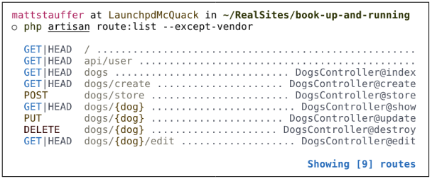

# Controladores

He mencionado los controladores varias veces, pero hasta ahora, la mayoría de los ejemplos han mostrado clausuras de rutas. En el patrón MVC, los controladores son esencialmente clases que organizan la lógica de una o más rutas juntas en un solo lugar. Los controladores tienden a agrupar rutas similares, especialmente si su aplicación está estructurada en un formato tradicional similar a CRUD; en este caso, un controlador podría manejar todas las acciones que se pueden realizar en un recurso en particular.

:::info ¿Qué es CRUD?
CRUD significa _create_, _read_, _update_ y _delete_, que son las cuatro operaciones principales que las aplicaciones web suelen ofrecer sobre un recurso. Por ejemplo, puedes crear una nueva entrada de blog, leerla, actualizarla o eliminarla.
:::

Puede resultar tentador incluir toda la lógica de la aplicación en los controladores, pero es mejor pensar en los controladores como los policías de tráfico que dirigen las solicitudes HTTP por toda la aplicación. Dado que existen otras formas en las que las solicitudes pueden llegar a la aplicación — trabajos cron, llamadas a la línea de comandos de Artisan, trabajos en cola, etc. — es aconsejable no depender demasiado de los controladores para el comportamiento. Esto significa que el trabajo principal de un controlador es capturar la intención de una solicitud HTTP y pasarla al resto de la aplicación.

Por lo tanto, creemos un controlador. Una forma sencilla de hacerlo es con un comando de Artisan, por lo que desde la línea de comandos, ejecute lo siguiente:

```sh
php artisan make:controller TaskController
```

:::info Artisan y generadores de Artisan

Laravel incluye una herramienta de línea de comandos llamada Artisan.
Artisan se puede utilizar para ejecutar migraciones, crear usuarios y otros registros de bases de datos manualmente y realizar muchas otras tareas manuales que se realizan una sola vez.

Bajo el espacio de nombres `make`, Artisan proporciona herramientas para generar archivos de esqueleto para una variedad de archivos del sistema. Eso es lo que nos permite ejecutar `php artisan make:controller`.

Para obtener más información sobre esta y otras características de Artisan, consulte [aquí](../artisan-and-tinker/an-introduction-to-artisan.html).
:::

Esto creará un nuevo archivo llamado `TaskController.php` en `app/Http/Controllers`, con el contenido que se muestra en el siguiente ejemplo.

_Controlador generado por defecto_
```php
<?php

namespace App\Http\Controllers;

use Illuminate\Http\Request;

class TaskController extends Controller
{
//
}
```

Modifique este archivo como se muestra en el ejemplo siguiente, creando un nuevo método público llamado `index()`. Solo devolveremos algo de texto allí.

_Ejemplo de controlador simple_
```php
<?php

namespace App\Http\Controllers;

class TaskController extends Controller
{

    public function index()
    {
        return 'Hello, World!';
    }
}
```

Luego, como aprendimos antes, conectaremos una ruta a él, como se muestra en el ejemplo siguiente.

_Ruta para el controlador simple_
```php
// routes/web.php
<?php

use Illuminate\Support\Facades\Route;
use App\Http\Controllers\TaskController;

Route::get('/', [TaskController::class, 'index']);
```

Eso es todo. Visita la ruta `/` y verás las palabras _“Hello, World!”_

El uso más común de un método controlador, entonces, será algo como el ejemplo siguiente, que proporciona la misma funcionalidad que nuestro [ejemplo de clausura de ruta](./views.html#pasando-variables-a-las-vistas).

_Ejemplo de método de controlador común_
```php
// TaskController.php
...
public function index()
{
    return view('tasks.index')
        ->with('tasks', Task::all());
}
```

Este método controlador carga la vista `resources/views/tasks/index.blade.php` o `resources/views/tasks/index.php` y le pasa una única variable llamada `tasks`, que contiene el resultado del método Eloquent `Task::all()`.

:::info Generación de Controladores de Recursos
Si desea crear un controlador de recursos con métodos generados automáticamente para todas las rutas de recursos básicas como `create()` y `update()`, puede pasar el indicador `--resource` al usar `php artisan make:controller`:
```sh
php artisan make:controller TaskController --resource
```
:::

## Obtener la Entrada del Usuario

La segunda acción más común que se realiza en un método de controlador es tomar la entrada del usuario y actuar en consecuencia. Esto introduce algunos conceptos nuevos, así que echemos un vistazo a un poco de código de muestra y analicemos las nuevas partes.

Primero, vinculemos nuestra ruta; consulte el siguiente ejemplo.

_Vinculación de acciones de formulario básicas_
```php
// routes/web.php
Route::get('tasks/create', [TaskController::class, 'create']);
Route::post('tasks', [TaskController::class, 'store']);
```

Tenga en cuenta que estamos vinculando la acción `GET` de `tasks/create` (que muestra un formulario para crear una nueva tarea) y la acción `POST` de `tasks` (que es donde nuestro formulario `POST` hará cuando estemos creando una nueva tarea). Podemos suponer que el método `create()` en nuestro controlador solo muestra un formulario, así que veamos el método `store()` en el siguiente ejemplo.

_Método común de controlador de entrada de formulario_
```php
// TaskController.php
...
public function store()
{
    Task::create(request()->only(['title', 'description']));

    return redirect('tasks');
}
```

Este ejemplo utiliza modelos Eloquent y la funcionalidad `redirect()`, y hablaremos más sobre ellos más adelante, pero por ahora hablemos rápidamente sobre cómo obtenemos nuestros datos aquí.

Estamos usando el asistente `request()` para representar la solicitud HTTP (más sobre esto más adelante) y usamos su método `only()` para extraer solo los campos `title` y `description` que envió el usuario.

Luego, pasamos esos datos al método `create()` de nuestro modelo `Task`, que crea una nueva instancia de la tarea con `title` establecido en el título ingresado y `description` establecido en la descripción ingresada. Finalmente, redirigimos nuevamente a la página que muestra todas las tareas.

Aquí hay algunas capas de abstracción en funcionamiento, que cubriremos en un segundo, pero debes saber que los datos que provienen del método `only()` provienen del mismo conjunto de datos del que extraen todos los métodos comunes utilizados en el objeto `Request`, incluidos `all()` y `get()`. El conjunto de datos del que extrae cada uno de estos métodos representa todos los datos proporcionados por el usuario, ya sean de parámetros de consulta o valores `POST`. Entonces, nuestro usuario completó dos campos en la página "agregar tarea": ​​"título" y "descripción".

Para desglosar un poco la abstracción, `request()->only()` toma una matriz asociativa de nombres de entrada y los devuelve:

```php
request()->only(['title', 'description']);
// returns:
[
    'title' => 'Whatever title the user typed on the previous page',
    'description' => 'Whatever description the user typed on the previous page',
]
```

Y `Task::create()` toma una matriz asociativa y crea una nueva tarea a partir de ella:

```php
Task::create([
    'title' => 'Buy milk',
    'description' => 'Remember to check the expiration date this time, Norbert!',
]);
```

Al combinarlos, se crea una tarea con solo los campos “título” y “descripción” proporcionados por el usuario.

## Inyección de Dependencias en los Controladores

Las fachadas y los ayudantes globales de Laravel presentan una interfaz sencilla para las clases más útiles en el código base de Laravel. Puede obtener información sobre la solicitud actual y la entrada del usuario, la sesión, los cachés y mucho más.

Pero si prefiere inyectar sus dependencias, o si desea utilizar un servicio que no tiene una fachada o un ayudante, deberá encontrar alguna forma de incorporar instancias de estas clases a su controlador.

Esta es nuestra primera exposición al contenedor de servicios de Laravel. Por ahora, si no le resulta familiar, puede pensar en él como un poco de magia de Laravel; o, si desea saber más sobre cómo funciona realmente, puede pasar directamente [aquí](../the-container/a-quick-intro-to-dependency-injection.html).

Todos los métodos del controlador (incluidos los constructores) se resuelven fuera del contenedor de Laravel, lo que significa que cualquier cosa que escribas y que el contenedor sepa cómo resolver se inyectará automáticamente.

:::info Typehints en PHP
_Sugerencia de tipo_ en PHP significa poner el nombre de una clase o interfaz delante de una variable en la firma de un método:

```php
public function __construct(Logger $logger) {}
```
Este typehint le dice a PHP que todo lo que se pasa al método _debe_ ser del tipo `Logger`, que podría ser una interfaz o una clase.
:::

Como buen ejemplo, ¿qué sucede si prefiere tener una instancia del objeto `Request` en lugar de usar el asistente global? Simplemente escriba `Illuminate\Http\Request` en los parámetros de su método, como en el ejemplo siguiente.

_Inyección de método de controlador mediante sugerencia de tipo_
```php
// TaskController.php
...
public function store(\Illuminate\Http\Request $request)
{
    Task::create($request->only(['title', 'description']));

    return redirect('tasks');
}
```

Entonces, has definido un parámetro que debe pasarse al método `store()`. Y como la has tipado, y como Laravel sabe cómo resolver ese nombre de clase, vas a tener el objeto `Request` listo para que lo uses en tu método sin trabajo de tu parte. Sin vinculación explícita, sin nada más — solo está ahí como la variable `$request`.

Y, como se puede ver al comparar los ejemplos anteriores, el ayudante `request()` y el objeto `Request` se comportan exactamente de la misma manera.

## Controladores de Recursos

A veces, nombrar los métodos de los controladores puede ser la parte más difícil de escribir un controlador. Afortunadamente, Laravel tiene algunas convenciones para todas las rutas de un controlador REST/CRUD tradicional (llamado _controlador de recursos_ en Laravel); Además, viene con un generador listo para usar y una definición de ruta conveniente que le permite vincular un controlador de recursos completo a la vez.

Para ver los métodos que Laravel espera para un controlador de recursos, generemos un nuevo controlador desde la línea de comandos:

```sh
php artisan make:controller MySampleResourceController --resource
```

Ahora abre `app/Http/Controllers/MySampleResourceController.php`. Verás que viene precargado con bastantes métodos. Veamos qué representa cada uno. Usaremos una `Task` como ejemplo.

### Los métodos de los controladores de recursos de Laravel

[¿Recuerdas la tabla anterior? Esta tabla muestra el verbo HTTP](../routing-and-controllers/a-quick-intro-to-mvc-the-http-verbs-and-rest.html#los-verbos-http), la URL, el nombre del método del controlador y el nombre de cada uno de estos métodos predeterminados que se generan en los controladores de recursos de Laravel.

### Vincular un controlador de recursos

Hemos visto que estos son los nombres de ruta convencionales que se usan en Laravel y también que es fácil generar un controlador de recursos con métodos para cada una de estas rutas predeterminadas. Afortunadamente, no tienes que generar rutas para cada uno de estos métodos de controlador a mano, si no lo deseas. Hay un truco para eso, llamado _vinculación de controlador de recursos_. Observa el ejemplo siguiente.

_Vinculación del controlador de recursos_
```php
// routes/web.php
Route::resource('tasks', TaskController::class);
```

Esto vinculará automáticamente todas las rutas enumeradas en la [tabla anterior](../routing-and-controllers/a-quick-intro-to-mvc-the-http-verbs-and-rest.html#los-verbos-http) para este recurso a los nombres de método apropiados en el controlador especificado. También nombrará estas rutas de manera apropiada; por ejemplo, el método `index()` en el controlador de recursos de tareas se llamará `tasks.index`.

:::info `artisan route:list`
Si alguna vez te encuentras en una situación en la que te preguntas qué rutas tiene disponibles tu aplicación actual, existe una herramienta para eso: desde la línea de comandos, ejecuta `php artisan route:list` y obtendrás una lista de todas las rutas disponibles. Prefiero `php artisan route:list --exclude-vendor` para no ver todas las rutas extrañas que mis dependencias registran para que funcionen (ver Figura siguiente).
:::


_`artisan route:list`_

## Controladores de Recursos de API
Cuando trabajas con API RESTful, la lista de posibles acciones en un recurso no es la misma que con un controlador de recursos HTML. Por ejemplo, puedes enviar una solicitud `POST` a una API para crear un recurso, pero no puedes realmente "mostrar un formulario de creación" en una API.

Para generar un _controlador de recursos API_, que es un controlador que tiene la misma estructura que un controlador de recursos excepto que excluye las acciones de _creación_ y _edición_, pase la bandera `--api` al crear un controlador:

```sh
php artisan make:controller MySampleResourceController --api
```

Para vincular un controlador de recursos API, utilice el método `apiResource()` en lugar del método `resource()`, como se muestra en el ejemplo siguiente.

_Vínculo del controlador de recursos API_
```php
// routes/web.php
Route::apiResource('tasks', TaskController::class);
```

## Controladores de Acción Simple

Habrá ocasiones en sus aplicaciones en las que un controlador solo deba dar servicio a una única ruta. Es posible que se pregunte cómo nombrar el método del controlador para esa ruta. Afortunadamente, puede apuntar una única ruta a un único controlador sin preocuparse por nombrar el método.

Como ya sabrás, el método `__invoke()` es un método mágico de PHP que te permite “invocar” una instancia de una clase, tratándola como una función y llamándola.

Esta es la herramienta que utilizan los controladores de acción única de Laravel para permitirle señalar una ruta a un solo controlador, como puede ver en el ejemplo siguiente.

_Uso del método `__invoke()`_
```php
// \App\Http\Controllers\UpdateUserAvatar.php
public function __invoke(User $user)
{
    // Update the user's avatar image
}

// routes/web.php
Route::post('users/{user}/update-avatar', UpdateUserAvatar::class);
```

